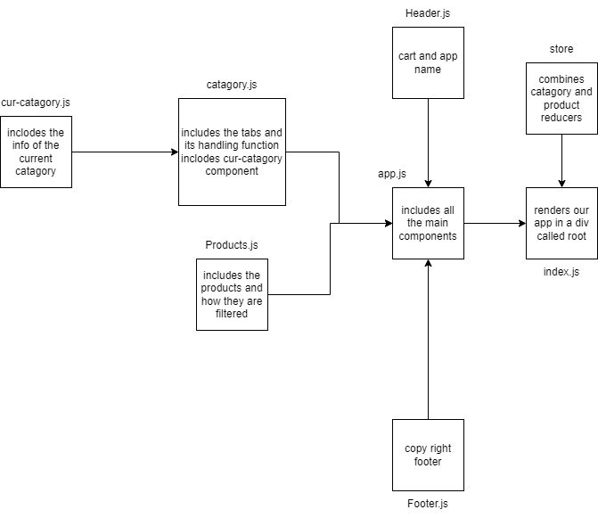

# storefront

A storefront is a place where people can buy things.

- phase: 1
  - a user can see a list of availalbe products and catagories in the store
  - a user can choose to view any catagory of products
  - a user can click add to cart to increment the numbers of products in the cart
- phase : 2
  - a user can see the total price of the products in the cart
  - a user can click clear cart to remove all products from the cart
  - a user can view product details
  - a user can can view items in the cart
  - added cart reducer to handle all cart states
- phase : 3
  - connected to api
  - added thunk middleware to handle api calls
  - created update function to increase/decrease inventory of products

## [Pull Request](https://github.com/Mhsalameh/storefront/pull/3)

## [Live URL](https://not-a-real-store.netlify.app/)

## UML

